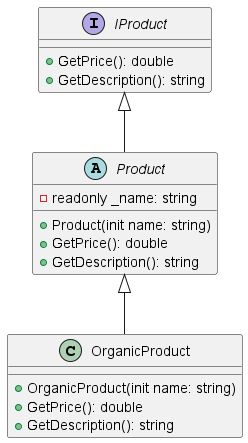

# Variant 10

## General Task Description

For this assignment, you are tasked with:

1. Creating an interface `IProduct` with the methods `double GetPrice()` and `string GetDescription()`.
2. Implementing this interface in an abstract class `Product` with a readonly field `string name` and a constructor with an init specifier.
3. Creating a class `OrganicProduct` that inherits from `Product` and implements the `IProduct` interface.

### General Requirements for Task Execution

- Ensure the `IProduct` interface is correctly implemented in the `Product` abstract class.
- The `Product` abstract class should have a readonly field `string name` and a constructor with an init specifier.
- Implement a `toString` method in all relevant classes to provide a string representation of the object.

